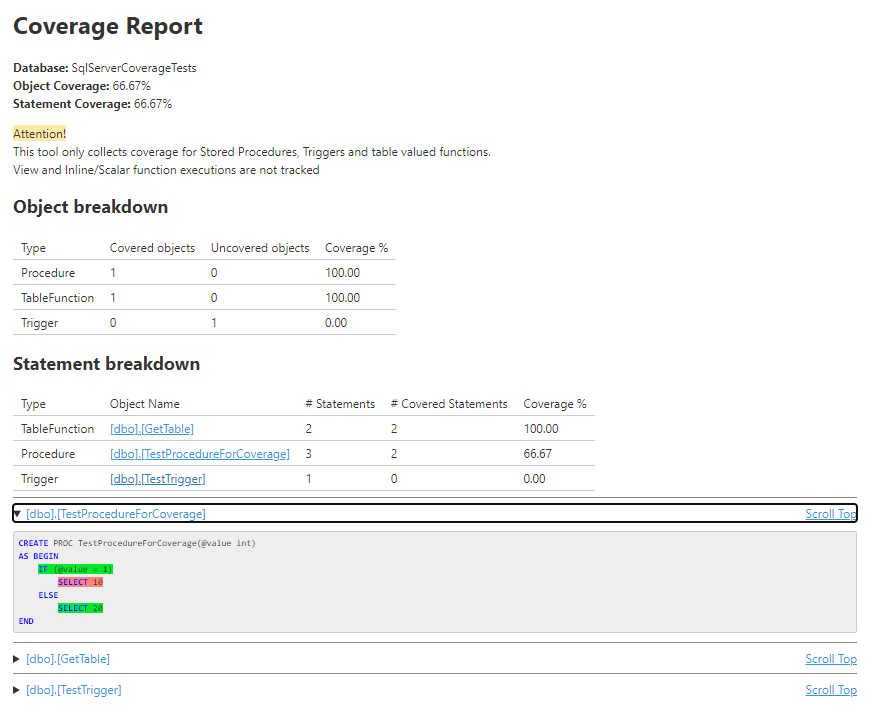
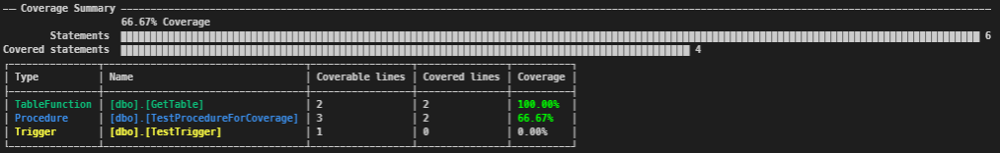

# SqlServerCoverage
A library and tool to collect SQL coverage data

HEAVILY INSPIRED BY https://github.com/GoEddie/SQLCover

Quoting GoEddie: `What you have looks great, I love the simplicity of OSS and the way it is licensed means you can do what you want :)`

This tool allows us to know how much of the stored procedures are covered by some action

It uses [XEvents](https://docs.microsoft.com/en-us/sql/relational-databases/extended-events/extended-events) on sql server to track which statements were used in the time a trace session was open.
Unfortunately Views, Scalar functions and inlined table functions are not trackable via this mecanism. Only Stored procedures, Triggers and Table Valued functions are tracked.

```cs
// Create the initial object to interface into the API
var coverageController = new CoverageSessionController("Data Source=.\SQLEXPRESS;Integrated Security=True");

// Create a new session to collect coverage
var session = coverageController.StartSession("DatabaseName");

// Do stufff in the database
...

// Collect coverage data
var results = session.ReadCoverage();

// export to html/opencover
results.Html();
results.OpenCoverXml();

// Clean up stuff
session.StopSession();
```

There are 3 projects, the unit tests, the lib itself and a command line interface. We can use it like this

```powershell
$conn = "Data Source=.\SQLEXPRESS;Integrated Security=True"
$db = "DatabaseName"

#start a session and get the ID
$id = dotnet sql-coverage start --connection-string=$conn --database=$db
if ($LASTEXITCODE -ne 0) { throw $id }

#collect coverage data
dotnet sql-coverage collect --connection-string=$conn --id=$id `
  --html --opencover --sonar --summary --output=testresults

#cleanup
dotnet sql-coverage stop --connection-string=$conn --id=$id
```

This is a sample summary from the console and attached is a sample HTML report



This is a screenshot of the terminal summary, created with [Spectre.Console](https://spectreconsole.net/)



The OpenCover xml report also exports the source objects that can then be used by [ReportGenerator](https://danielpalme.github.io/ReportGenerator/) to generate a report

It can also export on the [sonar generic coverage](https://docs.sonarqube.org/latest/analysis/generic-test/) format

# Build and test
On the root directory just run `.\scripts\build.ps1` to build and `.\scripts\test.ps1` to test

It assumes .net 5.0 and an SQL server instance available at localhost with integrated security

the build script will pack and install a local dotnet tool

the test script will run the unit tests and also test the commandline interface
